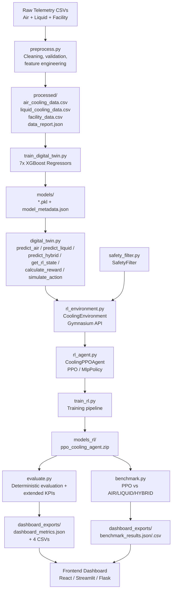

# 🧊 AI-Powered Data Center Cooling Optimization Platform

> A Digital Twin + Reinforcement Learning system that learns when to use **air**, **liquid**, or **hybrid** cooling to cut water and energy consumption while keeping data center thermal operations safe.


---

## Overview

Data centers spend enormous amounts of energy and water keeping server racks within safe thermal limits. Most facilities run cooling on **static rules**: fixed chiller setpoints, fixed AHU schedules, or manual operator overrides that rarely adapt to real-time workload and ambient conditions.

This project replaces that static rulebook with a **learned policy**. A reinforcement learning agent observes the current thermal and water-usage state of the facility and decides, step by step, whether **AIR cooling**, **LIQUID cooling**, or a **HYBRID** of both is the best choice *right now* — balancing water savings, energy savings, cooling efficiency, and a hard safety ceiling on temperature deviation.

### Why traditional approaches fall short

- **Fixed setpoints** can't react to workload spikes, ambient temperature swings, or time-of-day load patterns.
- **Rule-based heuristics** ("if temp > X, switch to liquid") require manual tuning and don't generalize across operating regimes.
- **Pure simulation** (CFD/physics models) is too slow for real-time decision-making and too expensive to run continuously.

### How this project solves it

1. A **Digital Twin** built from real telemetry (XGBoost regressors) predicts outlet temperature, energy cost, temperature deviation, water usage, liquid-loop outlet temperature, thermal stability, and cooling efficiency — all from operating parameters.
2. A **Gymnasium environment** wraps the Digital Twin so a reinforcement learning agent can interact with it step-by-step, exactly like a real control loop.
3. A **PPO agent** (Stable-Baselines3) learns a policy that picks AIR / LIQUID / HYBRID at every timestep to maximize a reward built from sustainability and safety priorities.
4. A **Safety Filter** sits between the agent and the simulated plant, vetoing or overriding any action that would push the system into an unsafe thermal or water-usage state.
5. **Evaluation and benchmarking tools** export dashboard-ready JSON/CSV so the learned policy can be compared directly against fixed AIR-only, LIQUID-only, and HYBRID-only baselines.

---

## Problem Statement

Cooling typically accounts for a large share of total data center energy draw, and evaporative/liquid cooling systems consume substantial volumes of water — a resource under increasing regulatory and environmental scrutiny, especially in water-stressed regions. Operators face a continuous, multi-objective trade-off:

- **Minimize water consumption** (primary sustainability objective)
- **Minimize energy consumption** (secondary objective)
- **Maintain safe operating temperatures** (mandatory — hardware damage and downtime are non-negotiable failure modes)
- **Maximize cooling efficiency** so the above three don't conflict more than necessary

These objectives pull in different directions depending on workload, ambient temperature, and time of day — which is precisely the kind of sequential decision problem reinforcement learning is suited for, provided there is a safety layer that a learned policy cannot override.

---

## Key Features

- 🌬️ **Air cooling support** — modeled via XGBoost regressors trained on real cold-source control telemetry (`Server_Workload`, `Inlet_Temperature`, `Chiller_Usage`, `AHU_Usage`, etc.)
- 💧 **Liquid cooling support** — modeled via a separate XGBoost pipeline trained on liquid-loop sensor data (`avg_P_ac`, `avg_P_cu`, `avg_T_out`, `avg_T_MEAS`, `avg_T_celCC`, thermal stability and cooling efficiency scores)
- 🔀 **Hybrid cooling strategy** — a combined prediction layer that blends air and liquid outputs into water savings %, energy savings %, and a 0–100 sustainability score
- 🧠 **Reinforcement learning optimization** — PPO (Stable-Baselines3, `MlpPolicy`) learns a 3-action discrete policy (AIR / LIQUID / HYBRID) over a 4-dimensional observation space
- 🛡️ **Safety monitoring** — a stateless `SafetyFilter` validates every proposed action against temperature, water-usage, cooling-efficiency, and liquid-outlet-temperature thresholds, with automatic safe-action substitution and structured intervention reporting
- 📊 **Sustainability metrics** — water savings %, energy savings %, sustainability score, thermal stability, cooling efficiency, temperature deviation, all tracked per-step and per-episode
- 📤 **Dashboard exports** — `dashboard_metrics.json`, `reward_timeseries.csv`, `action_distribution.csv`, `safety_summary.csv`, `extended_kpis.csv` — all React/Streamlit/Flask consumable
- 🏁 **Benchmarking** — head-to-head comparison of the learned PPO policy against fixed AIR-only, LIQUID-only, and HYBRID-only strategies on identical episodes
- 🗣️ **Strategy explainability** — every evaluation run produces a plain-English `strategy_reason` describing *why* a strategy was recommended, in terms of measured efficiency, savings, and temperature deviation
- 🔁 **Real-time-style optimization loop** — the environment's `reset()` randomizes `Server_Workload` (10–95%) and `Ambient_Temperature` (20–40°C) every episode, so the policy is trained across a realistic operating envelope rather than a single fixed point

---

## System Architecture



**Architectural principle:** the Digital Twin (XGBoost) is the *environment simulator*; the PPO agent is the *decision-maker*; the Safety Filter has *veto authority* over both. No component re-implements another's logic — `rl_environment.py` delegates all physics to `digital_twin.simulate_action()`, and `evaluate.py`/`benchmark.py` reuse the exact same `simulate_action()` and `SafetyFilter` calls used during training, so evaluation results are guaranteed consistent with training dynamics.

---

## Project Workflow

1. **Preprocess** raw telemetry (air cooling, liquid cooling, facility layout) into validated, feature-engineered CSVs with a full data quality report — strictly real-data, no synthetic fallback.
2. **Train the Digital Twin**: 7 independent XGBoost regressors (4 air-side, 3 liquid-side) predict outlet temperature, energy cost, temperature deviation, water usage, liquid outlet temperature, thermal stability, and cooling efficiency.
3. **Wrap the twin in a Gymnasium environment**: `CoolingEnvironment` exposes a `Box(4,)` observation space (`temperature_deviation`, `water_usage`, `liquid_outlet_temp`, `cooling_efficiency`) and a `Discrete(3)` action space (AIR / LIQUID / HYBRID).
4. **Apply the Safety Filter** before every step — it inspects the current state, computes a risk score and level (LOW/MEDIUM/HIGH/CRITICAL), and substitutes a safer action if the proposed one would be executed from an already-unsafe state.
5. **Train PPO** (`train_rl.py` → `CoolingPPOAgent`) for a configurable number of timesteps, with an `EvalCallback` tracking reward history and checkpointing the best model.
6. **Evaluate deterministically** (`evaluate.py`): run N episodes with `deterministic=True`, collect per-step KPIs including the four extended Digital Twin outputs (`sustainability_score`, `thermal_stability`, `outlet_temperature`, `liquid_outlet_temp`), and export a full dashboard payload plus four CSVs.
7. **Benchmark** (`benchmark.py`): run the same rollout logic for fixed AIR-only, LIQUID-only, HYBRID-only policies and the trained PPO model on identical seeded episodes, producing an objective comparison table.
8. **Feed the dashboard**: every JSON/CSV artifact in `dashboard_exports/` is designed to be read directly by a frontend with no additional transformation.

---

## Technology Stack

| Category | Technology |
|---|---|
| Language | Python 3.10+ |
| Digital Twin models | XGBoost (`XGBRegressor`) |
| Data processing | Pandas, NumPy |
| RL framework | Stable-Baselines3 (PPO, `MlpPolicy`) |
| RL environment API | Gymnasium |
| Model serialization | Pickle (`.pkl`), SB3 `.zip` |
| Config / metadata | JSON (`model_metadata.json`, `data_report.json`, `dashboard_metrics.json`) |
| Logging | Python `logging` (structured, per-module loggers) |
| CLI | `argparse` |
| Export formats | JSON, CSV (`csv.DictWriter`) |

---

## Machine Learning Pipeline

### 1. Data Preprocessing (`preprocess.py`)

- Loads **three real datasets**: air cooling telemetry (`cold_source_control_dataset.csv`), liquid cooling telemetry (`final_dataset_std.csv`, semicolon-delimited and already z-score standardized), and facility layout data (multiple rack/exhaust/design-temperature tables).
- Strict **no-synthetic-data policy**: missing files raise `FileNotFoundError`, missing columns raise `ValueError` listing every missing column, and an authenticity check flags zero-variance or perfectly-evenly-spaced columns as likely synthetic.
- **Air cooling features engineered**: `Cooling_Efficiency`, `Cooling_Ratio`, `Ambient_Inlet_Delta`, `Energy_per_Workload`, `Water_Usage_Estimate`, `Heat_Load_Index`.
- **Liquid cooling features engineered**: `avg_P_ac`, `avg_P_cu`, `avg_T_out`, `avg_T_MEAS`, `avg_T_celCC`, `delta_T_out_meas`, `delta_T_meas_cell`, `thermal_stability_score`, `cooling_efficiency_score` — computed as aggregates over 8 parallel sensor channels (`P_ac-0..7`, `P_cu-0..7`, etc.) without re-normalizing already-standardized data.
- **Facility data**: `layout.csv` LEFT JOINed with `layout_2.csv` on `[Rack, First Row]`, then joined to exhaust/design-temperature tables on matching U-position keys — with explicit verification that no Cartesian join occurs and that duplicate-source tables (`Table2.csv` ≡ `layout_2.csv`) are excluded rather than double-counted.
- Outputs: `processed/air_cooling_data.csv`, `processed/liquid_cooling_data.csv`, `processed/facility_data.csv`, `processed/data_report.json`.

### 2. Digital Twin Training (`train_digital_twin.py`)

Trains **7 independent XGBoost regressors**, 80/20 train-test split, `random_state=42`:

| Model | Target | Domain |
|---|---|---|
| `xgb_air_outlet_temperature` | `Outlet_Temperature` | Air |
| `xgb_air_energy_cost` | `Total_Energy_Cost` | Air |
| `xgb_air_temp_deviation` | `Temperature_Deviation` | Air |
| `xgb_air_water_usage` | `Water_Usage_Estimate` | Air |
| `xgb_liquid_avg_t_out` | `avg_T_out` | Liquid |
| `xgb_liquid_stability` | `thermal_stability_score` | Liquid |
| `xgb_liquid_efficiency` | `cooling_efficiency_score` | Liquid |

Each model's MAE / RMSE / R² is recorded in `models/model_metadata.json` and used at inference time to compute a **confidence tier** (`HIGH` if R² ≥ 0.75, `MEDIUM` if ≥ 0.60, else `LOW`).

### 3. Digital Twin Inference (`digital_twin.py`)

- Loads all 7 models once via a singleton `_ModelRegistry`, with per-model confidence tagging.
- `predict_air(params)` → outlet temperature, energy cost, temperature deviation, water usage + per-field confidence.
- `predict_liquid(params)` → liquid outlet temperature, thermal stability, **cooling efficiency (normalized to [0,1] and clamped inside `predict_liquid()`)** + per-field confidence.
- `predict_hybrid(air_params, liquid_params)` → combines both into `water_savings_percent`, `energy_savings_percent`, `sustainability_score` (0–100 weighted composite), and a heuristic `recommended_strategy`.
- All numeric outputs are clamped to physically plausible bounds via a centralized `_BOUNDS` table (e.g. `cooling_efficiency ∈ [0,1]`, `sustainability_score ∈ [0,100]`, `liquid_outlet_temp ∈ [5,80]°C`).

### 4. Reinforcement Learning Integration

- `get_rl_state(air_params, liquid_params)` — returns **only the four RL-reliable signals** (`temperature_deviation`, `water_usage`, `liquid_outlet_temp`, `cooling_efficiency`), all derived from the **HIGH-confidence (R² ≥ 0.75)** XGBoost models: `air_temp_deviation` (R²=0.9975), `air_water_usage` (R²=0.9517), `liquid_avg_t_out` (R²=0.7957), `liquid_efficiency` (R²=0.9691).
- `calculate_reward(state, previous_state, overheating_threshold=5.0)` — computes the 5-component reward described below.
- `simulate_action(action, air_params, liquid_params, previous_state)` — applies action-specific dynamics multipliers, clamps the resulting state, computes the reward, and returns `{next_state, reward_breakdown, hybrid_output, action, action_label}`.

### 5. Evaluation Process

`evaluate.py` runs **N deterministic episodes** through `CoolingEnvironment`, calling `model.predict(obs, deterministic=True)` at every step, passing the action through `SafetyFilter.validate_action()`, then calling `simulate_action()` directly (so `hybrid_output` — including `sustainability_score`, `thermal_stability`, `outlet_temperature` — is captured at every step), and finally `env.step()` to keep the environment's internal observation buffer consistent for the next prediction.

---

## Reinforcement Learning Design

### State Space

| Index | Field | Range | Source |
|---|---|---|---|
| 0 | `temperature_deviation` | 0 – 50 °C | `xgb_air_temp_deviation` (R²=0.9975) |
| 1 | `water_usage` | 0 – 1e5 L | `xgb_air_water_usage` (R²=0.9517) |
| 2 | `liquid_outlet_temp` | 0 – 80 °C | `xgb_liquid_avg_t_out` (R²=0.7957) |
| 3 | `cooling_efficiency` | 0 – 1 | `xgb_liquid_efficiency` (R²=0.9691), normalized |

Observation space: `gymnasium.spaces.Box(low=OBS_LOW, high=OBS_HIGH, shape=(4,), dtype=np.float32)`.

### Action Space

`gymnasium.spaces.Discrete(3)`

| Action | Label | Effect (multiplicative, applied to `next_state`) |
|---|---|---|
| 0 | **AIR** | `temperature_deviation ×1.08`, `water_usage ×0.60`, `cooling_efficiency ×0.92` — plus a low-workload bonus (workload < 25%: `cooling_efficiency ×1.04`, `temperature_deviation ×0.97`) |
| 1 | **LIQUID** | `temperature_deviation ×0.80`, `water_usage ×1.25`, `cooling_efficiency ×1.08` — plus a high-workload efficiency bonus (workload > 80%: `×1.10`) and a thermal-emergency bonus (`temperature_deviation > 5°C`: `temperature_deviation ×0.70`, `cooling_efficiency ×1.08`) |
| 2 | **HYBRID** | `temperature_deviation ×0.85`, `water_usage ×0.85`, `cooling_efficiency ×1.08` — plus a "sweet spot" bonus when `25 ≤ workload ≤ 80` and `temperature_deviation ≤ 5°C` (`cooling_efficiency ×1.03`) |

This gives each strategy a genuine Pareto trade-off: **AIR** is water-frugal but weaker on temperature control; **LIQUID** is the strongest on temperature control (especially under thermal emergencies) but the most water-intensive; **HYBRID** is balanced and gains an extra efficiency bonus in normal operating ranges. All three carry **conditional bonuses tied to `Server_Workload`**, so the optimal action genuinely depends on the current operating regime rather than being fixed.

### Reward Function

```
r_overheat   = -5.0  × overheating_penalty       (1.0 if temp_dev > threshold, else 0.0)
r_temp       = -2.0  × tanh(temp_dev / threshold) (bounded to [-2, 0])
r_water      =  4.0  × water_savings              (water_savings = 1 − min(water_usage/0.40, 1.0))
r_efficiency =  1.5  × cooling_efficiency
r_energy     =  1.0  × energy_savings             (energy_savings = cooling_efficiency)

total_reward = r_overheat + r_temp + r_water + r_efficiency + r_energy
```

| Priority | Component | Weight | Bound |
|---|---|---|---|
| 1 — Prevent overheating | `r_overheat` | -5.0 | sharp, bounded |
| 2 — Reduce temperature deviation | `r_temp` | -2.0 (tanh-scaled) | soft, bounded to [-2, 0] |
| 3 — Reduce water usage | `r_water` | +4.0 | dominant positive term |
| 4 — Improve cooling efficiency | `r_efficiency` | +1.5 | direct signal |
| 5 — Reduce energy | `r_energy` | +1.0 | proxy via cooling efficiency |

This design intentionally **bounds every penalty term** (via `tanh` for temperature, a fixed -5.0 for overheating) so no single component can structurally dominate an episode's return regardless of agent behavior — while keeping water savings as the largest possible positive contribution, matching the project's stated sustainability priority order.

### PPO Configuration

| Hyperparameter | Default |
|---|---|
| Policy | `MlpPolicy` |
| `learning_rate` | 3e-4 |
| `n_steps` | 2048 |
| `batch_size` | 64 |
| `gamma` | 0.99 |
| `gae_lambda` | 0.95 |
| `clip_range` | 0.2 |
| `ent_coef` | 0.01 |
| `vf_coef` | 0.5 |
| `max_grad_norm` | 0.5 |
| `seed` | 42 |

### Exploration Strategy

PPO's entropy bonus (`ent_coef=0.01`) provides the primary exploration signal during training. Additionally, **`CoolingEnvironment.reset()` randomizes `Server_Workload` (Uniform 10–95%) and `Ambient_Temperature` (Uniform 20–40°C) every episode**, and initializes `temperature_deviation`, `water_usage`, `liquid_outlet_temp`, and `cooling_efficiency` from wide uniform ranges (clamped to safe bounds). This ensures the policy is trained across a broad operating envelope rather than converging to a single-point solution.

### Cooling Strategy Optimization

The agent's objective is to learn a **state-conditional policy**: given the current `(temperature_deviation, water_usage, liquid_outlet_temp, cooling_efficiency)`, choose the action that maximizes expected discounted reward. Because the action dynamics now include workload-conditional bonuses (low-workload AIR bonus, high-workload and thermal-emergency LIQUID bonuses, mid-range HYBRID sweet spot), the theoretically optimal policy is expected to be genuinely mixed rather than a single dominant action — e.g.:

- **Low workload + cool ambient** → AIR (water-frugal, low-workload efficiency bonus applies, temperature risk is low)
- **High thermal load / overheating risk** → LIQUID (thermal-emergency bonus aggressively reduces temperature deviation)
- **Medium workload, balanced constraints** → HYBRID (sweet-spot efficiency bonus in the 25–80% workload band)

---

## Cooling Strategy Logic

### AIR Cooling

Represents minimal mechanical/liquid cooling intervention — primarily airflow-based (AHU-driven). **Water-cheapest** option (`water_usage ×0.60`), but **weakens temperature control** (`temperature_deviation ×1.08`) and slightly reduces cooling efficiency (`×0.92`). Receives a small efficiency and temperature bonus when `Server_Workload < 25%`, reflecting that low-load conditions need less aggressive cooling to begin with.

**When selected:** Low workload, ambient conditions already favorable, water conservation is the dominant concern and current temperature deviation has headroom below the safety threshold.

### LIQUID Cooling

Represents direct-to-chip or immersion-style liquid cooling — **strongest thermal control** (`temperature_deviation ×0.80`) at the cost of **highest water usage** (`water_usage ×1.25`) and a cooling-efficiency gain (`×1.08`). Two conditional bonuses make LIQUID especially valuable under stress: a high-workload efficiency bonus (`Server_Workload > 80%` → `×1.10`) and a thermal-emergency response (`temperature_deviation > 5°C` → `temperature_deviation ×0.70`, `cooling_efficiency ×1.08`).

**When selected:** High thermal load, temperature deviation approaching or exceeding the safety threshold, or sustained high workload where the efficiency bonus outweighs the water cost.

### HYBRID Cooling

A balanced combination of air and liquid cooling, applying moderate improvements across all three state dimensions (`temperature_deviation ×0.85`, `water_usage ×0.85`, `cooling_efficiency ×1.08`). Gains an additional efficiency bonus (`×1.03`) specifically in the **"sweet spot"** operating band: `25% ≤ Server_Workload ≤ 80%` and `temperature_deviation ≤ 5°C`.

**When selected:** Medium workload within the normal operating band, where neither pure water conservation (AIR) nor pure thermal aggression (LIQUID) is clearly dominant — HYBRID's sweet-spot bonus makes it the efficiency-maximizing choice.

---

## Safety Mechanism

`safety_filter.py` implements a **stateless** `SafetyFilter` that sits between the RL agent's proposed action and the Digital Twin's execution of that action.

### Thresholds (centralized constants)

| Constant | Value | Meaning |
|---|---|---|
| `TEMP_DEVIATION_LIMIT` | 6.0 °C | Above this, state is unsafe |
| `COOLING_EFFICIENCY_MIN` | 0.0 | Efficiency must be non-negative |
| `WATER_USAGE_MIN` | 0.0 L | Water usage must be non-negative |
| `LIQUID_OUTLET_TEMP_MIN` | 0.0 °C | Hardware lower bound |
| `LIQUID_OUTLET_TEMP_MAX` | 80.0 °C | Hardware upper bound |

### Unsafe Action Prevention

`validate_action(proposed_action, state)`:
1. Runs `_collect_violations(state)` — checks for NaN/Inf (checked first, short-circuits all other checks), temperature deviation over limit, efficiency/water/outlet-temperature out of bounds.
2. If violations exist, calls `_choose_safe_alternative()`:
   - If temperature is over limit **and** liquid outlet temp has headroom → switch to **LIQUID** (best heat removal).
   - If liquid outlet temp itself is critically high → switch to **AIR** (avoid further loading the liquid loop).
   - Otherwise → fall back to **AIR** (`SAFE_FALLBACK_ACTION`, the most conservative default).
3. Returns `(approved_action, report)` where `report` includes `intervention_applied`, `reason`, `violations`, `risk_level`, and `risk_score` — fully structured for dashboard display.

### Thermal Threshold Handling

`evaluate_risk(state)` computes a continuous **risk score** as a weighted composite:

```
risk_score = 0.55 × temp_risk + 0.20 × efficiency_risk + 0.15 × water_risk + 0.10 × outlet_risk
```

mapped to categorical levels:

| Risk Score | Level |
|---|---|
| < 0.40 | LOW |
| 0.40 – 0.70 | MEDIUM |
| 0.70 – 0.90 | HIGH |
| ≥ 0.90 or NaN/Inf | CRITICAL |

### Emergency Cooling Behavior

`CoolingEnvironment.step()` checks `is_safe_state(next_state)` after every transition. If the resulting state violates any constraint, `terminated=True` and the episode ends with a structured `termination_reason` (e.g. `"unsafe_state: temperature_deviation=7.20°C exceeds limit 6.0°C"`), giving PPO a clear negative-consequence signal for policies that drive the system into unsafe territory.

---

## Sustainability Metrics

| Metric | Definition | Source |
|---|---|---|
| **Water Savings %** | `1 − min(water_usage / 0.40, 1.0)`, scaled to % | `calculate_reward()` / `hybrid_output["water_savings_percent"]` |
| **Energy Savings %** | Proxied by `cooling_efficiency` | `hybrid_output["energy_savings_percent"]` |
| **Cooling Efficiency** | Normalized `[0,1]` score from `xgb_liquid_efficiency` | `next_state["cooling_efficiency"]` |
| **Sustainability Score** | `0.40×water_savings + 0.30×energy_savings + 0.30×(efficiency×100) − 20×temp_penalty`, clamped `[0,100]` | `hybrid_output["sustainability_score"]` |
| **Temperature Deviation** | °C deviation from target, from `xgb_air_temp_deviation` | `next_state["temperature_deviation"]` |
| **Thermal Stability** | `[0,1]` score from `xgb_liquid_stability` | `hybrid_output["thermal_stability"]` |

All six are tracked **per-step** during evaluation and aggregated into per-episode means, exported in `dashboard_metrics.json` under `cooling_metrics` and `sustainability_metrics`, and per-episode in `extended_kpis.csv`.

---

## Evaluation and Benchmarking

### PPO Evaluation (`evaluate.py`)

Runs `N_EVAL_EPISODES` (default 20) deterministic episodes of `max_steps` (default 100) each, collecting:

- **Performance**: `mean_reward`, `max_reward`, `min_reward`, `std_reward`, `mean_episode_length`
- **Cooling metrics**: `mean_cooling_efficiency`, `mean_temp_deviation`, `mean_outlet_temperature`, `mean_liquid_outlet_temp`, `mean_thermal_stability`
- **Sustainability**: `mean_water_savings`, `mean_energy_savings`, `mean_sustainability_score`
- **Safety**: `unsafe_action_count`, `safety_interventions`
- **Strategy distribution**: per-action step counts and percentages (`AIR_pct`, `LIQUID_pct`, `HYBRID_pct`)

Includes **sanity checks** (`validate_metrics()`): strategy percentages should sum to ~100%, episode counts should be non-zero, all rewards should be finite — logged as ✅/⚠️ without halting the pipeline.

### Baseline Comparison (`benchmark.py`)

Runs the **same rollout logic** for four policies on identical seeded episodes:

- **AIR baseline** — `_FixedPolicy(action=0)`, always selects AIR
- **LIQUID baseline** — `_FixedPolicy(action=1)`, always selects LIQUID
- **HYBRID baseline** — `_FixedPolicy(action=2)`, always selects HYBRID
- **PPO** — the trained model, `deterministic=True`

Each fixed baseline is a minimal duck-typed wrapper exposing `.predict(obs, deterministic=True) → (fixed_action, None)`, so the **identical rollout loop** (`_run_strategy`) is used for all four — guaranteeing apples-to-apples comparison.

### Benchmark Interpretation

The console report prints a comparison table (`Strategy | MeanRwd | Water% | Energy% | Effic. | TempDev | Sustain | TherStab | SafeInt`) and explicitly calls out, **without assuming PPO wins**:

- Best mean reward
- Best water savings
- Lowest temperature deviation
- Most safety interventions (a negative indicator)

This framing lets judges and operators verify the learned policy's advantage empirically rather than by assertion — if PPO does **not** outperform a fixed baseline on a given axis, that's visible directly in the table.

---

## Project Structure

```
hackathon_dc/
├── preprocess.py                  # Stage 1 — data validation, cleaning, feature engineering
├── train_digital_twin.py          # Stage 2 — trains 7 XGBoost regressors
├── digital_twin.py                # Stage 3 — inference engine + RL hooks
├── safety_filter.py               # Stage 3A — stateless safety guard
├── rl_environment.py              # Stage 3A — Gymnasium environment (CoolingEnvironment)
├── rl_agent.py                    # Stage 3B — PPO agent (CoolingPPOAgent)
├── train_rl.py                    # Stage 3B — training pipeline
├── evaluate.py                    # Stage 4 — standalone deterministic evaluation
├── benchmark.py                   # Stage 4 — PPO vs fixed-strategy comparison
│
├── processed/                     # preprocess.py outputs
│   ├── air_cooling_data.csv
│   ├── liquid_cooling_data.csv
│   ├── facility_data.csv
│   └── data_report.json
│
├── models/                         # train_digital_twin.py outputs
│   ├── xgb_air_outlet_temperature.pkl
│   ├── xgb_air_energy_cost.pkl
│   ├── xgb_air_temp_deviation.pkl
│   ├── xgb_air_water_usage.pkl
│   ├── xgb_liquid_avg_t_out.pkl
│   ├── xgb_liquid_stability.pkl
│   ├── xgb_liquid_efficiency.pkl
│   └── model_metadata.json
│
├── models_rl/                      # train_rl.py outputs
│   ├── ppo_cooling_agent.zip
│   ├── training_metrics.json
│   ├── evaluation_metrics.json
│   └── training_history.csv
│
├── dashboard_exports/              # evaluate.py + benchmark.py outputs
│   ├── dashboard_metrics.json
│   ├── reward_timeseries.csv
│   ├── action_distribution.csv
│   ├── safety_summary.csv
│   ├── extended_kpis.csv
│   ├── benchmark_results.json
│   └── benchmark_results.csv
│
└── README.md
```

---

## Installation Guide

```bash
# 1. Clone the repository
git clone <your-repo-url>
cd hackathon_dc

# 2. Create and activate a virtual environment
python3 -m venv venv
source venv/bin/activate        # on macOS/Linux
# venv\Scripts\activate          # on Windows

# 3. Install dependencies
pip install pandas numpy xgboost scikit-learn \
            gymnasium stable-baselines3 \
            matplotlib

# 4. Prepare datasets
# Place the following real CSVs in the project root (or pass --data-dir):
#   cold_source_control_dataset.csv
#   final_dataset_std.csv
#   layout.csv, layout_2.csv, Table2.csv, Table3.csv, exhaust_temp.csv

# 5. Run preprocessing
python preprocess.py --data-dir . --out-dir processed/

# 6. Train the Digital Twin
python train_digital_twin.py
```

---

## Usage Guide

```bash
# Data preprocessing
python preprocess.py

# Train the XGBoost Digital Twin (7 models)
python train_digital_twin.py

# Train the PPO RL agent
python train_rl.py --timesteps 50000 --eval-episodes 20 --max-steps 100

# Evaluate a trained model (no retraining)
python evaluate.py --model-path models_rl/ppo_cooling_agent.zip --episodes 20

# Benchmark PPO against fixed strategies
python benchmark.py --episodes 20 --max-steps 100

# Benchmark baselines only (no trained model required)
python benchmark.py --no-ppo
```

All scripts support `--log-level {DEBUG,INFO,WARNING,ERROR}` for verbosity control.

---

## Configuration

### Key Hyperparameters & Constants

| Parameter | File | Default | Notes |
|---|---|---|---|
| `TEMP_DEVIATION_LIMIT` | `safety_filter.py` | 6.0 °C | Hard safety ceiling |
| `DEFAULT_MAX_STEPS` | `rl_environment.py` | 100 | Steps per episode |
| `OBS_LOW` / `OBS_HIGH` | `rl_environment.py` | see code | Observation space bounds |
| `overheating_threshold` | `digital_twin.py::calculate_reward` | 5.0 °C | Used in reward shaping (distinct from the hard safety limit) |
| `learning_rate` | `rl_agent.py` | 3e-4 | PPO Adam LR |
| `n_steps` | `rl_agent.py` | 2048 | PPO rollout buffer |
| `batch_size` | `rl_agent.py` | 64 | PPO minibatch |
| `gamma` | `rl_agent.py` | 0.99 | Discount factor |
| `ent_coef` | `rl_agent.py` | 0.01 | Exploration bonus |
| `N_EVAL_EPISODES` | `evaluate.py` | 20 | Evaluation episode count |
| `N_BENCHMARK_EPISODES` | `benchmark.py` | 20 | Benchmark episode count |
| `seed` | `rl_agent.py` | 42 | Reproducibility |

> **Note:** `TEMP_DEVIATION_LIMIT` (6.0°C, the hard safety cutoff used by `SafetyFilter`) and `overheating_threshold` (5.0°C, used inside `calculate_reward()` for reward shaping) are intentionally distinct — the reward function begins penalizing the agent *before* the safety filter would terminate the episode, giving PPO a gradient signal ahead of the hard limit.

---

## Results

> Populate this table after running `evaluate.py` and `benchmark.py` against your trained model. Example structure based on the metrics each script produces:

### Evaluation Summary (`dashboard_metrics.json`)

| Metric | Value |
|---|---|
| Mean Reward | _from `performance.mean_reward`_ |
| Mean Episode Length | _from `performance.mean_episode_length`_ |
| Cooling Efficiency | _from `cooling_metrics.cooling_efficiency`_ |
| Temperature Deviation | _from `cooling_metrics.temperature_deviation`_ °C |
| Sustainability Score | _from `sustainability_metrics.sustainability_score`_ /100 |
| Water Savings | _from `sustainability_metrics.water_savings_percent`_ % |
| Energy Savings | _from `sustainability_metrics.energy_savings_percent`_ % |
| Safety Interventions | _from `safety_metrics.safety_interventions`_ |

### Strategy Distribution

| Strategy | % of Steps |
|---|---|
| AIR | _`strategy_distribution.AIR_pct`_ |
| LIQUID | _`strategy_distribution.LIQUID_pct`_ |
| HYBRID | _`strategy_distribution.HYBRID_pct`_ |

### Benchmark Comparison (`benchmark_results.csv`)

| Strategy | Mean Reward | Water Savings % | Energy Savings % | Cooling Eff. | Temp Dev (°C) | Safety Interventions |
|---|---|---|---|---|---|---|
| AIR | _value_ | _value_ | _value_ | _value_ | _value_ | _value_ |
| LIQUID | _value_ | _value_ | _value_ | _value_ | _value_ | _value_ |
| HYBRID | _value_ | _value_ | _value_ | _value_ | _value_ | _value_ |
| **PPO** | _value_ | _value_ | _value_ | _value_ | _value_ | _value_ |

---

## Explainability

Every evaluation run produces a `strategy_reason` string — a plain-English explanation grounded in the **actual measured metrics from that run**, not a static template:

```python
strategy_reason = (
    f"{recommended_strategy} selected because it achieved "
    f"{cooling_efficiency:.4f} cooling efficiency, "
    f"{water_savings:.2f}% water savings, "
    f"{energy_savings:.2f}% energy savings while maintaining "
    f"{temperature_deviation:.2f}°C temperature deviation."
)
```

This is surfaced in both `dashboard_metrics.json` (top-level `strategy_reason` field) and the console report under "Strategy Reason". The underlying `recommend_strategy()` method in `rl_agent.py` additionally provides per-call rationale text for AIR/LIQUID/HYBRID, e.g.:

> **LIQUID**: "Liquid cooling is recommended. The current temperature deviation of 5.80°C benefits from the higher heat removal capacity of liquid systems (liquid outlet: 5.0°C, efficiency: 52.17%)."

> **HYBRID**: "Hybrid cooling is recommended. Balancing air and liquid modes will optimise water savings while maintaining a cooling efficiency of 49.76% against a 4.88°C temperature deviation."

> **AIR**: "Air cooling is sufficient. The temperature deviation (5.86°C) and water usage (0.2L) are within safe limits, and air cooling avoids unnecessary liquid system activation."

---

## Future Improvements

- 🔌 **Real IoT sensor integration** — replace XGBoost-predicted state with live telemetry from BMS/DCIM systems via OPC-UA or MQTT.
- 📡 **Live telemetry streaming** — feed `CoolingEnvironment` from a real-time data bus instead of `reset()`-time randomization.
- 🖥️ **Edge deployment** — package the trained PPO policy (`ppo_cooling_agent.zip`) for on-prem inference at the rack-controller level.
- 🤝 **Multi-agent RL** — extend from a single facility-wide policy to per-zone or per-rack agents that coordinate via a shared reward.
- 🔧 **Predictive maintenance** — extend the Digital Twin with failure-mode regressors (pump degradation, sensor drift) feeding into the safety filter's risk score.
- 🌍 **Carbon-aware optimization** — incorporate grid carbon-intensity signals into the reward function alongside water and energy savings.
- 📈 **Expanded observation space** — re-incorporate facility-level features (`Heat_Density`, `Hotspot_Risk`, `Rack_Efficiency_Score` from `processed/facility_data.csv`) into the RL state.

---

## Deployment

> **The following sections are placeholders** — update with your actual deployment configuration.

### Local Deployment
```bash
# Placeholder — run the full pipeline locally
python preprocess.py && python train_digital_twin.py && python train_rl.py
```

### Docker Deployment
```dockerfile
# Placeholder Dockerfile
FROM python:3.11-slim
WORKDIR /app
COPY . .
RUN pip install -r requirements.txt
CMD ["python", "evaluate.py"]
```

### Cloud Deployment
> Placeholder — e.g. deploy `models_rl/ppo_cooling_agent.zip` + `digital_twin.py` behind a FastAPI inference endpoint on AWS/GCP/Azure.

### API Deployment
> Placeholder — wrap `CoolingPPOAgent.recommend_strategy()` and `evaluate.py`'s metrics pipeline behind a REST API (e.g. FastAPI) for dashboard consumption.

### Frontend Integration
> Placeholder — connect `dashboard_exports/*.json` and `*.csv` to a React/Streamlit dashboard. All exports are pre-structured for direct consumption (see `dashboard_metrics.json` sections: `performance`, `cooling_metrics`, `sustainability_metrics`, `safety_metrics`, `strategy_distribution`, `timeseries`).


---

## Acknowledgements

- **Stable-Baselines3** for the PPO implementation and training callbacks
- **XGBoost** for the gradient-boosted regression models underlying the Digital Twin
- **Gymnasium** for the standardized RL environment interface
- The open data center telemetry datasets that made real-data-only Digital Twin training possible
- The ASHRAE thermal guidelines that informed safety threshold design

---

<p align="center">Built for a hackathon. Designed to be extended into production.</p>
